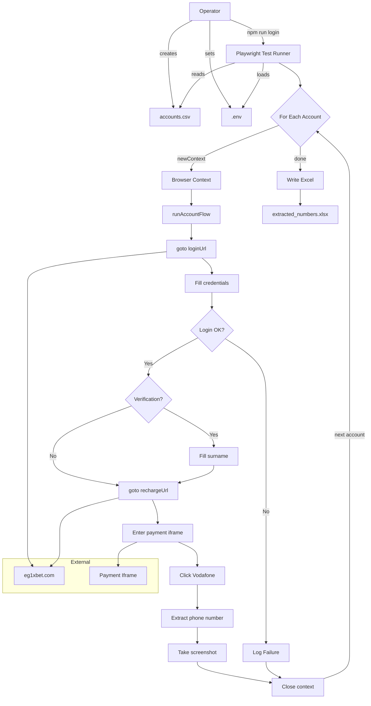
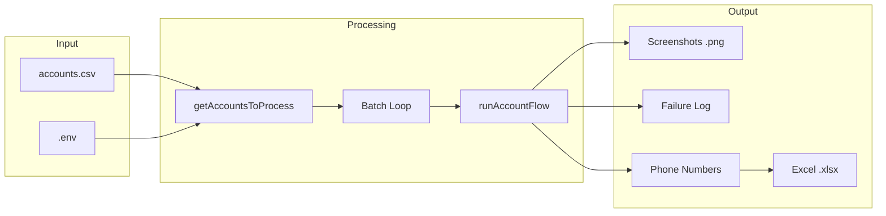
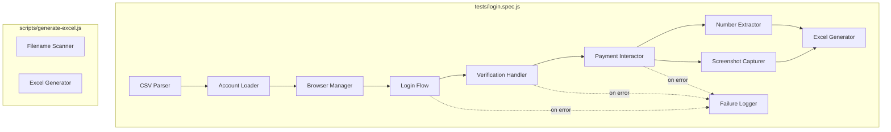

# CODEBASE_KNOWLEDGE.md - Complete Brain Dump

> **Version**: 1.4
> **Last Updated**: 2026-08-02
> **Status**: Authoritative
> **Repository Commit**: `dfa181b` (1xauto HEAD)
>
> **Supersedes**: `master-knowledge-document.md`, `assets/architecture-diagrams.md`
>
> **Repository**: `1xauto` (package name `1xbet-login-flow`)
> **App version**: 0.1.0
> **Purpose**: Playwright browser automation that logs into 1xBet (Egypt), navigates to the Vodafone deposit flow, extracts Egyptian mobile numbers, and captures payment-window screenshots.

---

## Table of Contents

1. [High-Level Overview](#1-high-level-overview)
2. [Architecture and Data Flow](#2-architecture-and-data-flow)
3. [File Index](#3-file-index)
4. [Feature-by-Feature Analysis](#4-feature-by-feature-analysis)
5. [Nuances, Gotchas and Operational Rules](#5-nuances-gotchas-and-operational-rules)
6. [Failure Taxonomy](#6-failure-taxonomy)
7. [Technical Reference and Glossary](#7-technical-reference-and-glossary)
8. [Extension and Modification Guide](#8-extension-and-modification-guide)
9. [Architecture Diagrams (Mermaid)](#9-architecture-diagrams-mermaid)

---

## 1. High-Level Overview

### 1.1 What It Is

A **single-test Playwright automation** that:

1. Reads a batch of 1xBet account credentials from `accounts.csv` or `.env`.
2. For each account, opens a fresh Chromium browser context, logs into `eg1xbet.com`, handles optional surname verification, navigates to the Vodafone deposit page, extracts the displayed Egyptian mobile number (`01XXXXXXXXX`), and takes a screenshot.
3. After the batch completes, writes all unique extracted numbers to `extracted_numbers.xlsx`.

### 1.2 Who Uses It

An **operator** (the repo owner) who needs to:

- Process dozens/hundreds of 1xBet accounts in a single run.
- Collect the Vodafone deposit phone numbers displayed on each account's payment page.
- Screenshot the payment modal for manual verification or record-keeping.
- Manually handle CAPTCHAs, OTPs, or any challenge screens that appear (the browser runs **headed** by default).

### 1.3 Tech Stack

| Layer | Technology | Version (locked) |
|-------|-----------|-----------------|
| Runtime | Node.js | >= 20 |
| Language | JavaScript (ES Modules) | -- |
| Browser automation | Playwright Test | 1.61.1 |
| Env config | dotenv | 16.x |
| Spreadsheet I/O | xlsx (SheetJS) | 0.18.5 |
| CI/CD | GitHub Actions | workflow_dispatch only |

### 1.4 Key Dependencies

- **`@playwright/test`** (devDep): Test runner and Chromium automation.
- **`dotenv`** (devDep): Loads `.env` into `process.env` with `override: true`.
- **`xlsx`** (dep): Creates `.xlsx` Excel files with extracted phone numbers.

### 1.5 Business Purpose

This tool exists to **batch-collect Vodafone payment identifiers** (Egyptian mobile numbers) from 1xBet accounts. The numbers are extracted from the deposit modal's "Copy" buttons and compiled into a spreadsheet. The screenshots serve as visual proof of the payment window state.

---

## 2. Architecture and Data Flow

### 2.1 High-Level Architecture

```
Operator / User
  |-- Creates accounts.csv (or sets .env vars)
  |-- Runs `npm run login` or triggers GitHub Actions
  |-- Manually handles CAPTCHAs/OTPs in the visible browser
  |
  v
Playwright Test Runner (playwright.config.js)
  |-- Loads .env via dotenv (override: true)
  |-- timeout: 0 (unlimited per test)
  |-- headless: only if HEADLESS=true env var
  |-- viewport: 1440x960
  |-- testDir: ./tests
  |
  v
tests/login.spec.js (360 lines)
  |-- Account Loading: getAccountsToProcess()
  |--     |-- CSV Parser: parseCsv() + parseCsvLine()
  |
  |-- For Each Account (sequential loop):
  |     1. browser.newContext() -> new page
  |     2. runAccountFlow(page, account, i, total)
  |        a. goto loginUrl
  |        b. Fill username + password
  |        c. Submit login
  |        d. Detect login failure
  |        e. Handle account verification (surname)
  |        f. goto rechargeUrl
  |        g. Enter payment iframe
  |        h. Click Vodafone option (#vodafone_1)
  |        i. Wait for payment modal
  |        j. Extract phone number from modal
  |        k. Take screenshot
  |     3. Close page + context
  |
  |-- Write Excel: extracted_numbers.xlsx
  |-- Failure logger: logs/failed-accounts.log
  |
  v
External: eg1xbet.com
  |-- /en/user/login           (login page)
  |-- /en/user/accountverify   (surname confirmation)
  |-- /en/office/recharge      (deposit page with payment iframe)
  |-- iframe: /paysystems/deposit/ (Vodafone payment modal)

Optional wrapper: `run-loop.js` (`npm run loop`) re-invokes the whole Playwright run in an infinite loop with a configurable cooldown — used when a batch is larger than one comfortable run.
```

### 2.2 Data Flow

```
accounts.csv  ----+
                  +--> loadAccounts() --> getAccountsToProcess()
.env vars    ----+         |
                           v
                Array of Account {username, password, surname}
                           |
                +----------+----------+
                |  For each account:  |
                |  (sequential loop)  |
                +----------+----------+
                           |
            +--------------+--------------+
            v              v              v
      Screenshot      Phone #        Failure Log
        .png          extracted       (on error)
            |              |
            +--------+-----+
                     v
              extracted_numbers.xlsx
              (after all accounts)
```

### 2.3 External Integrations

| Integration | Type | URL/Target | Purpose |
|------------|------|-----------|---------|
| 1xBet Login | Web | `https://eg1xbet.com/en/user/login` | Authenticate with username/password |
| 1xBet Verification | Web | `/en/user/accountverify` (regex match) | Surname confirmation when challenged |
| 1xBet Recharge | Web | `https://eg1xbet.com/en/office/recharge` | Navigate to deposit page |
| Vodafone Payment | Iframe | `iframe[src*="/paysystems/deposit/"]` | Access Vodafone payment option |
| Vodafone Modal | Iframe child | `#payment_modal_container` | Display payment details with copy buttons |

### 2.4 GitHub Actions Workflow

- **File**: `.github/workflows/playwright.yml` (71 lines)
- **Trigger**: `workflow_dispatch` (manual only)
- **Runner**: `ubuntu-latest`
- **Steps**: Checkout -> Node 20 (`npm install`) -> `npx playwright install --with-deps chromium` -> restore state cache (`actions/cache` key `batch-state-${{ github.run_id }}`, restore-keys `batch-state-`) -> `npm run login` -> save state cache (`path: state.json`) -> upload `run-summary.json` artifact -> render `## Run summary` into `$GITHUB_STEP_SUMMARY`
- **Secrets**: `ONEXBET_USERNAME`, `ONEXBET_PASSWORD`, `ONEXBET_SURNAME`, `PROXY_URL`
- **Vars**: `MAX_RETRIES` (retry ladder tunable)
- **Run env**: `HEADLESS: 'true'`, `ALLOW_LIVE_RUN: 'true'` (the spec refuses live execution unless set; `DRY_RUN` bypasses navigation without it)
- **Limitation (broken as analyzed)**: no `HEADLESS: 'true'` was a prior state — fixed in P1; `playwright install` now includes `--with-deps`. Cannot handle manual CAPTCHAs in CI. C1 verification remains blocked by the GitHub billing lock (§0.4 external blocker).

---

## 3. File Index

| Priority | Path | Lines | Purpose |
|----------|------|-------|---------|
| **+ (core)** | `tests/login.spec.js` | 431 | **Orchestration**: login flow, verification handling, payment iframe interaction, screenshot capture, batch loop with retry ladder, proxy wiring, state persistence (resume), structured logging, run summary, run stats, Excel generation (pure helpers live in `lib/`) |
| **+ (core)** | `lib/csv.js` | 85 | Pure CSV parsing + account loading: `parseCsvLine`, `parseCsv`, `loadAccounts`, `getAccountsToProcess` |
| **+ (core)** | `lib/extractor.js` | 26 | Pure helpers: `extractPhoneNumber`, `buildScreenshotPath`, `fallbackScreenshotPath` |
| **+ (core)** | `lib/state.js` | 52 | State persistence (P4): `readState`, atomic `writeState` (tmp→fsync→rename), `resolveStartIndex` |
| **+ (core)** | `lib/retry.js` | 99 | Full retry ladder: `classifyError`, `isRetryable`, `readMaxRetries`, `backoffDelay`, `runWithRetry` (P3 + onSuccess/onFailure hooks P4) |
| **+ (core)** | `lib/proxy.js` | 47 | Full proxy parsing: `parseProxyUrl` (throws on malformed), `maskProxyPassword` (P3) |
| **+ (core)** | `lib/logger.js` | 33 | Structured logger (P5): `formatLogLine` (ISO timestamp + padded level + `[k=v]` fields) + `createLogger` (console + optional file) |
| **+ (core)** | `lib/runSummary.js` | 96 | Run summary (P5): `buildSummary` (all §5.2 fields + operational extras) + `formatSummary` (human line) + `FAILURE_CATEGORIES` |
| **+ (tests)** | `tests/unit/*.test.js` | 8 | `node:test` unit tests for `lib/*` (run via `npm test`; retry/proxy/state/logger/summary suites, 60 tests P5) |
| **+ (config)** | `playwright.config.js` | 23 | Playwright runner config: test dir, timeout=0, headless toggle (CI must set `HEADLESS=true`), viewport 1440x960, Chromium disk-cache launch args (`.browser-cache`) |
| **+ (config)** | `package.json` | 19 | Project metadata, npm scripts (`login`, `loop`, `excel`, `test`) |
| **+ (runner)** | `run-loop.js` | 26 | Local looping wrapper: re-runs `npm run login` in an infinite loop with a cooldown; forces `HEADLESS=true` (state-driven resume supersedes it after P4 — use plain `npm run login`) |
| **+ (template)** | `.env.example` | 6 | Template for required env vars + optional `PROXY_URL`, `MAX_RETRIES`, `ALLOW_LIVE_RUN` |
| **+ (utility)** | `scripts/generate-excel.js` | 30 | Standalone utility: scans `screenshots/` dir for phone-number filenames, generates `extracted_numbers.xlsx` |
| **+ (CI)** | `.github/workflows/playwright.yml` | 71 | GitHub Actions workflow: installs Chromium `--with-deps`, state cache restore/save (`batch-state`), runs headless with `ALLOW_LIVE_RUN=true`, uploads `run-summary.json` artifact, renders `$GITHUB_STEP_SUMMARY` |
| **+ (CI)** | `.github/workflows/docs-validation.yml` | 28 | Validates the AI doc set on push/PR (runs `.github/scripts/validate-docs.mjs`) |
| **+ (docs)** | `README.md` | 74 | Setup instructions, usage, output files |
| **- (log)** | `logs/failed-accounts.log` | 1300+ | Append-only failure log with timestamps and error details |
| **- (meta)** | `deleting clones.txt` | 5 | PowerShell snippets for finding/deleting duplicate directories |
| **- (config)** | `.gitignore` | 11 | Ignores node_modules, .env, accounts.csv, screenshots, test-results, extracted_numbers.xlsx, .browser-cache, state.json, run-summary.json, logs/run-*.log |

*File Index is the live structural map, maintained per phase. Granular line-number references in §4–§5 describe the `dfa181b` analyzed snapshot; re-verify them when the analysis is next refreshed.*

---

## 4. Feature-by-Feature Analysis

### Feature 1: Account Loading and CSV Parsing

**Purpose**: Load credentials from either a CSV file or environment variables, with CSV taking priority. This enables batch processing of hundreds of accounts.

**Technical Details**:

- **Entry**: `getAccountsToProcess()` at `lib/csv.js`
- **CSV Path**: `path.resolve(process.cwd(), 'accounts.csv')` -- resolved at runtime relative to CWD (`tests/login.spec.js:12`)
- **CSV Parser**: Custom implementation in `lib/csv.js` (`parseCsvLine` / `parseCsv`) -- not using a library. Handles quoted fields with escaped double-quotes.
- **Fallback**: If `accounts.csv` does not exist or is empty, falls back to a single account from env vars `ONEXBET_USERNAME`, `ONEXBET_PASSWORD`, `ONEXBET_SURNAME`.
- **Filtering**: Accounts without both `username` AND `password` are filtered out (in `lib/csv.js` `loadAccounts`).
- **Headers**: Case-insensitive (`header.toLowerCase()`). Expected columns: `username` (optional), `email` (used as the login when `username` is absent — the shipped CSV has no `username` column, only `Email`), `password`, `surname`. Current CSV header: `Region,City,Email,First_name,surname,Password,re-enter_password`.

**Interactions**: Feeds into the main batch loop in the test body (line 325). The `START_INDEX` env var controls which account to resume from.

**Edge Cases**:

- Empty CSV -> falls back to env vars
- Malformed CSV rows -> silently dropped if username/password empty
- `START_INDEX` > account count -> warns and skips all

---

### Feature 2: Browser Login Flow

**Purpose**: Authenticate against the 1xBet Egyptian site (`eg1xbet.com`) for each account.

**Technical Details**:

- **Entry**: `runAccountFlow()` at `tests/login.spec.js:106`
- **Login URL**: `https://eg1xbet.com/en/user/login` (hardcoded, line 6)
- **Locators**:
  - Username: `input#username` (line 125)
  - Password: `input#username-password` (line 126)
  - Submit: `button.auth-form-fields__submit` (line 127)
- **Wait Strategy**:
  - `domcontentloaded` for initial navigation (line 123)
  - 30-second timeout for element visibility (lines 129-131)
  - 10-second timeout for URL change after submit (line 139-142)
- **Failure Detection** (lines 144-159):
  - Checks if URL still contains `/user/login` AND login form is still visible
  - Attempts to extract error hint text matching `/incorrect|invalid|wrong|password|login/i`
  - Throws descriptive error with hint if found, generic message otherwise

**Interactions**: After successful login, proceeds to account verification check, then recharge page navigation.

**Business Logic**: The `.catch(() => {})` on `waitForURL` (line 142) means the script does not fail if the URL does not change -- it just continues and checks the state manually.

---

### Feature 3: Account Verification (Surname Confirmation)

**Purpose**: Handle the optional account verification screen that 1xBet sometimes presents, where the user must confirm their surname.

**Technical Details**:

- **Detection**: After login, waits for navigation to URL matching `/en/user/accountverify(?:[/?#]|$)` with 10s timeout (line 161)
- **Locator**:
  - Surname input: `page.getByRole('textbox')` -- role-based, fragile if page has multiple textboxes
  - Confirm button: `page.getByRole('button', { name: 'Confirm', exact: true })`
- **Validation**: Expects exactly 1 textbox and exactly 1 Confirm button (lines 176-177)
- **Action**: Fills surname, clicks confirm, waits 2 seconds for processing (line 182)
- **Error**: If surname not provided in env/CSV, throws error asking user to set `ONEXBET_SURNAME`

**Interactions**: Only triggered if the site redirects to the verification URL after login. Surname comes from `accounts.csv` or `ONEXBET_SURNAME` env var.

**Gotcha**: The `getByRole('textbox')` selector is very generic. If 1xBet adds any other textbox to the verification page, this will break.

---

### Feature 4: Vodafone Payment Window Interaction

**Purpose**: Navigate to the deposit page, access the payment iframe, select Vodafone, and extract the phone number displayed in the payment modal.

**Technical Details**:

- **Recharge URL**: `https://eg1xbet.com/en/office/recharge` (hardcoded, line 7)
- **Payment iframe locator**: `iframe[src*="/paysystems/deposit/"]` (line 188) -- uses partial `src` match
- **Vodafone option**: `#vodafone_1` inside the payment iframe (line 190)
- **Payment modal**: `#payment_modal_container` inside the iframe (line 191)
- **Amount field**: `#amount` inside the iframe (line 197)

**Phone Number Extraction** (lines 210-261) -- **multi-strategy fallback**:

1. Iterate all `.copy_content_btn.modal-message-btn[title="Copy"]` buttons in the modal
2. For each button, try in order:
   - `data-clipboard-text` attribute with regex `/01\d{9}/`
   - `data-text` attribute with regex `/01\d{9}/`
   - Button's own `textContent()` with regex `/01\d{9}/`
   - Parent element's `textContent()` with regex `/01\d{9}/`
3. If no number found from copy buttons, scan the entire `paymentModal.textContent()` as a final fallback

**Interactions**: The extracted number is added to the global `uniqueNumbers` Set and `screenshotCounts` Map, which are later used for screenshot naming and Excel generation.

---

### Feature 5: Screenshot Capture and Naming

**Purpose**: Capture a screenshot of the payment window and name it with the extracted phone number for easy identification.

**Technical Details**:

- **Naming logic** (lines 263-283):
  - If number extracted: `<number>.png` (first occurrence), `<number>(N).png` for duplicates
  - If no number: `vodafone-deposit-<ISO-timestamp>.png`
- **Duplicate handling**: `screenshotCounts` Map tracks per-number count. While the target filename exists, increment counter (line 274-278).
- **Screenshot area**: Clipped to viewport width and the bottom of the payment modal: `{x:0, y:0, width: viewport.width, height: ceil(modalBox.y + modalBox.height)}` (lines 288-296)
- **Directory**: `screenshots/` created with `mkdirSync(recursive: true)` (line 286)

**Interactions**: Screenshots feed into `scripts/generate-excel.js` which scans filenames for phone numbers. Also, the Excel file generated at the end of the test uses the `uniqueNumbers` Set.

---

### Feature 6: Excel Generation (Phone Numbers)

**Purpose**: Compile all unique extracted Egyptian mobile numbers into an Excel spreadsheet.

**Two paths**:

**Path A: In-test generation (automatic)**

- **Location**: `tests/login.spec.js:349-359` -- runs after the entire batch completes
- **Input**: `uniqueNumbers` Set (global, accumulated across all accounts)
- **Output**: `extracted_numbers.xlsx` in project root
- **Library**: `xlsx` (SheetJS)

**Path B: Standalone script (`scripts/generate-excel.js`)**

- **Trigger**: `npm run excel`
- **Input**: Scans `screenshots/` directory for `.png` files, extracts phone numbers from filenames via regex `/(01\d{9})/`
- **Output**: Same `extracted_numbers.xlsx`
- **Purpose**: Regenerate the Excel without re-running the browser automation

---

### Feature 7: Batch Processing with Resume Support

**Purpose**: Process a large number of accounts sequentially, with the ability to resume from a specific index — automatically across crashes (P4) or explicitly via `START_INDEX`.

**Technical Details**:

- **Loop**: Sequential `for...of` over accounts -- accounts are processed one at a time, not in parallel
- **Browser isolation**: Each account gets a fresh `browser.newContext()` + `page` -- no session leakage
- **State file (`state.json`)**: Written **after each account's final outcome** (success or exhausted retries) via the `onSuccess`/`onFailure` hooks. Format: `{ "batchId", "lastProcessedIndex", "totalAccounts", "updatedAt" }`. `lastProcessedIndex` is 1-based (the number of accounts fully processed). A crash loses only the in-flight account.
- **Resume precedence**: `START_INDEX` env (explicit) > `state.lastProcessedIndex + 1` (from state file) > `1` (fresh). See `resolveStartIndex()` (`lib/state.js:42-52`).
- **BATCH_ID**: When `BATCH_ID` is provided and differs from the state file's `batchId`, the run starts fresh at index 1 (new batch). When unset, the current run's timestamp becomes the batch ID.
- **STATE_FILE**: Env var to relocate the state file (default `./state.json`). Atomic writes (tmp -> fsync -> rename) prevent partial/corrupt state on crash.
- **START_INDEX**: Env var (1-based) to skip accounts before that index; overrides state when present.
- **Cleanup**: Each iteration closes page and context in `finally` block, with a delay between accounts
- **Error isolation**: Failures are caught per-account, logged, and the loop continues

**Interactions**: The `screenshotCounts` and `uniqueNumbers` global Maps persist across the entire batch run (cleared at test start). State is persisted through the retry hooks, so it reflects final outcomes only.

---

### Feature 8: Failure Logging

**Purpose**: Record all account-level failures with timestamps for later review.

**Technical Details**:

- **Location**: `logFailure()` at `tests/login.spec.js:98-104`
- **Path**: `logs/failed-accounts.log`
- **Format**: `[ISO-timestamp] username | error.message`
- **Append-only**: Uses `appendFileSync` -- multiple runs accumulate
- **Directory creation**: `mkdirSync(recursive: true)` ensures `logs/` exists

**Failure categories observed in the log**:

| Error Pattern | Count | Root Cause |
|--------------|-------|------------|
| `locator('input#username').toBeVisible()` timeout | ~60+ | Login page not loading / site blocking / CAPTCHA |
| `locator('#vodafone_1').toBeVisible()` timeout | ~30+ | Vodafone option not available for account / payment iframe not loading |
| `Login failed: Select a login option` | ~15 | Login form shows alternative login methods instead of username/password |
| `ENOSPC: no space left on device, write` | ~12 | Disk full -- screenshots filling up |
| `page.goto: Target page, context or browser has been closed` | ~5 | Browser/page closed unexpectedly (user intervention or crash) |
| `net::ERR_CONNECTION_CLOSED` | 2 | Network/server issue |
| `locator.click: Target page, context or browser has been closed` | 3 | Click attempted after page closure |
| `getByRole('textbox').toHaveCount(1)` fails (received 0) | 2 | Verification page UI changed |
| `#payment_modal_container` hidden | 1 | Modal exists but not visible |
| `copy_content_btn` not found | 2 | Copy button not rendered in modal |

---

### Feature 9: Looping Wrapper (`run-loop.js`)

**Purpose**: Re-run the entire `npm run login` batch automatically until stopped, so a large CSV can be processed over multiple Playwright invocations without operator attention.

**Technical Details**:

- **Entry**: top-level script `run-loop.js` (26 lines), invoked via `npm run loop`.
- **Config**: `COOLDOWN_MINUTES` (default `10`) pause between runs; `START_INDEX` passed through to the spec for resume; `HEADLESS` forced to `'true'` (line 6).
- **Loop**: infinite `while (true)` -> `execSync('npm run login', { stdio: 'inherit', env: process.env })` -> `await setTimeout(COOLDOWN_MS)`.
- **Error tolerance**: the `catch` on the sync call logs `Finished with errors` and still proceeds to the cooldown — the loop never stops on failure.

**Interactions**: Because it re-spawns the Playwright process, in-process state (`uniqueNumbers`, `screenshotCounts`) is lost between runs — resume relies on `START_INDEX`. The top-level `await` only works because the package is ESM (`"type": "module"`).

---

## 5. Nuances, Gotchas and Operational Rules

### 5.1 Critical Gotchas

1. **The `.catch(() => {})` on line 142 swallows the timeout error from `waitForURL`**. If login fails silently (no URL change), the script still detects it by re-checking the URL and login form visibility (lines 144-159). But if the page partially loads and the form disappears, it could slip through.

2. **`parseCsvLine()` is a hand-rolled CSV parser** (lines 14-41). It handles double-quote escaping but NOT:
   - Newlines inside quoted fields
   - Different line endings (partially handled via `split(/\r?\n/)`)
   - Leading BOM characters

3. **`password === surname` guard** (line 115-118): If an account has the same password and surname, the script throws. This is a deliberate anti-misconfiguration check -- the surname field is used for account verification, and having it match the password would be a mistake.

4. **The regex `/01\d{9}/` is hardcoded for Egyptian mobile numbers** (11 digits starting with `01`). This is region-specific and will not work for other countries' phone numbers.

5. **`screenshotCounts` and `uniqueNumbers` are module-level globals** (lines 11-12). They are cleared at test start (lines 302-303) but persist across accounts within a run. This is intentional -- they track cross-account deduplication.

6. **The payment iframe locator `iframe[src*="/paysystems/deposit/"]`** uses a partial match on the `src` attribute. If 1xBet changes this URL path, the entire payment flow breaks.

7. **The `START_INDEX` is 1-based** (line 314), matching human counting. Internally, the loop skips indices `< startIndex - 1` (line 326-328).

8. **The test timeout is 0 (unlimited)** (`playwright.config.js:9` and `test.setTimeout(0)` at line 301). Long batches can run for hours.

9. **`.catch(() => {})` pattern** is used extensively (lines 142, 145, 344, 345) to make operations best-effort. This is intentional for resilience but makes debugging harder.

10. **The Excel output path is relative to CWD**, not the script directory (line 354). Same for `accounts.csv` (line 9) and `screenshots/` (line 286).

### 5.2 Security Considerations

- Credentials are in `.env` (gitignored) or `accounts.csv` (gitignored). Neither should be committed.
- The GitHub Actions workflow uses repository secrets for the env vars.
- No credential encryption at rest -- relies on filesystem permissions.
- The automation does NOT bypass CAPTCHAs, OTPs, or security controls -- it is designed for manual operator intervention.

### 5.3 Performance Characteristics

- **Sequential processing**: One account at a time. No parallelism.
- **2-second delay between accounts** -- likely to avoid rate limiting.
- **30-second timeout** on most locator waits -- conservative to account for slow loads.
- **Retry ladder (P3)**: each account runs via `runAccountFlowWithRetry`; retryable errors (`network`, `browserClosed`, `disk`, `domTimeout`) retry with exponential backoff up to `MAX_RETRIES` (default 2 = 1 initial + 1 retry); non-retryable errors (`loginRejected`, `validation`, `other`) fail immediately. `logFailure()` runs only after the final attempt.
- **State persistence (P4)**: `state.json` is written atomically after every account's final outcome via the `onSuccess`/`onFailure` hooks. Crash resilience means the next run resumes at `lastProcessedIndex + 1`, losing only the in-flight account. State file is gitignored.
- **Structured logging (P5)**: all run output goes through `lib/logger.js` — lines like `[ts] [info]  [account=x] [phase=login] message`. `logs/failed-accounts.log` keeps its original byte format (append-only). A per-run log file `logs/run-<ISO>.log` is also written (gitignored).
- **Run summary (P5)**: `run-summary.json` is written at the end of every run (including DRY_RUN) via `writeRunSummary()`; the human one-liner (`Success rate: 87.5% (70/80) · unique numbers: 42 · slowest: x@y (90s) · network: 6, domTimeout: 4`) is printed to console and rendered into `$GITHUB_STEP_SUMMARY` in CI.
- **Live-run guard (P5)**: the spec throws unless `ALLOW_LIVE_RUN=true` (CI sets it) or `DRY_RUN=true` (validates without navigation). Prevents accidental live-site interaction during local development.
- **Disk usage**: Each run generates screenshots (PNG files). The `ENOSPC` errors in the log show this can fill disk on long runs.

### 5.4 Platform Notes

- **Primary target**: Windows (PowerShell). The `deleting clones.txt` has PowerShell snippets.
- **Cross-platform**: Uses `path.resolve()` and `path.join()` for paths. Should work on macOS/Linux.
- **GitHub Actions**: Runs on `ubuntu-latest`.

---

## 6. Failure Taxonomy

### Common Failure Modes and Remedies

| Failure | Cause | Remedy |
|---------|-------|--------|
| `input#username` not found | Login page blocked/changed, CAPTCHA challenge, rate limiting | Check manually, increase delay between accounts |
| `#vodafone_1` not found | Vodafone payment not available for account/region, iframe not loaded | Verify account has Vodafone option, check iframe load |
| `Login failed: Select a login option` | Site shows alternative login methods (email, phone, social) | Update selectors to handle alternative login UI |
| `ENOSPC: no space left on device` | Disk full from screenshots | Clean `screenshots/` directory before batch run |
| `Target page, context or browser has been closed` | User closed browser, browser crash | Run in headed mode, check for OS-level issues |
| `net::ERR_CONNECTION_CLOSED` | Network issue, IP blocking | Auto-retried (network) with backoff; rotate proxy when `PROXY_URL` set and this persists |
| `getByRole('textbox').toHaveCount(1)` fails | Verification page UI changed | Update selectors for new verification layout |
| `copy_content_btn` not found | Payment modal rendered without copy buttons | Check modal content structure, update selectors |

---

## 7. Technical Reference and Glossary

### 7.1 Glossary

| Term | Definition |
|------|-----------|
| **1xBet** | International online betting platform. This tool targets the Egyptian instance (`eg1xbet.com`). |
| **Vodafone deposit** | A payment method on 1xBet Egypt using Vodafone mobile wallet. The deposit modal shows a phone number to send money to. |
| **Account verification** | A security step where 1xBet asks for surname confirmation after login. |
| **Recharge** | 1xBet's term for the deposit/top-up page. |
| **Payment iframe** | An embedded iframe on the recharge page that hosts payment system UIs (Vodafone, etc.). |
| **Egyptian mobile number** | An 11-digit number starting with `01` (regex: `01\d{9}`). |
| **Copy button** | UI element in the payment modal that contains the phone number for copying. |
| **START_INDEX** | Environment variable to resume batch processing from a specific 1-based record number. Overrides the state file when set. |
| **STATE_FILE** | Environment variable for the state file path (default `./state.json`). Written atomically after each account. |
| **BATCH_ID** | Optional batch identifier. When it differs from the state file's `batchId`, the run restarts fresh at index 1. |
| **Browser context** | Playwright's isolated browser session -- each account gets a fresh one to prevent session leakage. |

### 7.2 Key Functions and Their Locations

| Function | File | Lines | Purpose |
|----------|------|-------|---------|
| `parseCsvLine(line)` | `lib/csv.js` | 1-17 | Parse a single CSV line with quote handling |
| `parseCsv(text)` | `lib/csv.js` | 19-35 | Parse full CSV text into array of objects |
| `loadAccounts(csvFilePath)` | `lib/csv.js` | 37-56 | Load accounts from `accounts.csv` file (email-as-username fallback, filtering) |
| `getAccountsToProcess(csvFilePath)` | `lib/csv.js` | 58-85 | Get accounts from CSV or fall back to env vars |
| `extractPhoneNumber(text)` | `lib/extractor.js` | 5-8 | First `/01\d{9}/` match or `''` |
| `buildScreenshotPath(number, count, existing)` | `lib/extractor.js` | 10-23 | `01xxxxxxxxx.png`, then `01xxxxxxxxx(n).png`, skipping existing files |
| `fallbackScreenshotPath(timestamp)` | `lib/extractor.js` | 25-26 | Timestamped fallback path when no number found |
| `readState(stateFilePath)` | `lib/state.js` | 13-23 | `null` when missing/invalid JSON; parsed state otherwise |
| `writeState(state, stateFilePath)` | `lib/state.js` | 25-40 | Atomic write: tmp file -> `fsyncSync` -> `renameSync`; creates dir recursively |
| `resolveStartIndex(state, explicit)` | `lib/state.js` | 42-52 | Explicit wins; else `lastProcessedIndex + 1`; else `1` |
| `classifyError(err)` | `lib/retry.js` | 22-29 | Categories: `network`/`browserClosed`/`disk`/`domTimeout` (retryable); `loginRejected`/`validation` (not retryable); `other` |
| `isRetryable(err)` | `lib/retry.js` | 31-33 | True iff `classifyError(err).retryable` |
| `readMaxRetries(env)` | `lib/retry.js` | 35-47 | `MAX_RETRIES` (default 2, integer >= 1, validated) |
| `backoffDelay(attempt, opts)` | `lib/retry.js` | 49-58 | `Math.min(2000 * 2**attempt, 15000) + [0,1000)` jitter |
| `runWithRetry(attemptFn, opts)` | `lib/retry.js` | 64-99 | Generic retry engine: runs `attemptFn` up to `maxRetries`; calls `onRetry` (per retry), `onSuccess` (final success), `onFailure` (final failure); returns `{ outcome, retries, error, category, value }` |
| `parseProxyUrl(url)` | `lib/proxy.js` | 2-38 | `null` if unset; `{ server, username?, password? }`; throws on malformed URL/protocol/missing host |
| `maskProxyPassword(url)` | `lib/proxy.js` | 40-46 | Redact `:pass@` -> `:***@` for safe logging |
| `buildSummary(input)` | `lib/runSummary.js` | 11-84 | Computes all §5.2 run-summary fields (`batchId`, timestamps, `durationMs`, counters, `successRate`, `uniqueNumbers`, `avgRuntimePerAccountMs`, `slowestAccount`, `failureCategories`, `screenshotsRetained`, `artifactNames`, `retryCount`) plus operational extras (`accountsRetried`, `startIndex`, `lastProcessedIndex`, `proxyEnabled`, `maxRetries`) |
| `formatSummary(summary)` | `lib/runSummary.js` | 86-105 | Human one-liner per §5.3: `Success rate: X% (s/t) · unique numbers: N · slowest: u (Ns) · cat: n, ...` |
| `FAILURE_CATEGORIES` | `lib/runSummary.js` | 1-10 | Canonical category keys used to zero-fill `failureCategories` |
| `formatLogLine({level, message, fields, ts})` | `lib/logger.js` | 8-18 | `[ISO] [level]  [k=v] ... message` (level padded to align `info`/`warn` with `error`) |
| `createLogger({stream, errorStream, logFile})` | `lib/logger.js` | 20-33 | Returns `{ info, warn, error }`; writes console + optional file (error→stderr) |
| `logFailure(account, error)` | `tests/login.spec.js` | 28-34 | Append failure entry to log file (byte-format unchanged) |
| `writeRunSummary(summary)` | `tests/login.spec.js` | 36-39 | Atomic-ish JSON write of `run-summary.json` (mkdir recursive) |
| `runAccountFlow(page, account, index, total, logger)` | `tests/login.spec.js` | 36-216 | **Main flow**: login, verify, recharge, extract, screenshot; structured logs; returns screenshot path |
| `runAccountFlowWithRetry(createContext, account, index, total, opts)` | `tests/login.spec.js` | 219-259 | **Retry controller**: fresh context per attempt, backoff, structured retry logs, forwards `onSuccess`/`onFailure` hooks for state persistence, cleanup (P3/P4) |
| `test('sign in to 1xBet', ...)` | `tests/login.spec.js` | 264-431 | **Test entry point**: loads accounts, resolves proxy, resolves start index from state (BATCH_ID/START_INDEX), enforces `ALLOW_LIVE_RUN`/`DRY_RUN`, runs batch loop with retry, writes `run-summary.json`, prints human summary, generates Excel |
| main logic | `scripts/generate-excel.js` | 1-30 | Standalone Excel generator from screenshot filenames |
| top-level loop | `run-loop.js` | 13-25 | Infinite re-run of `npm run login` with cooldown (see Feature 9) |

### 7.3 Key Constants and URLs

| Constant | Value | Location |
|----------|-------|----------|
| `loginUrl` | `https://eg1xbet.com/en/user/login` | `tests/login.spec.js:11` |
| `rechargeUrl` | `https://eg1xbet.com/en/office/recharge` | `tests/login.spec.js:12` |
| `accountVerificationUrl` | `/\/en\/user\/accountverify(?:[/?#]\|$)/` | `tests/login.spec.js:13` |
| `accountsFilePath` | `path.resolve(process.cwd(), 'accounts.csv')` | `tests/login.spec.js:14` |
| `failuresLogPath` | `path.resolve(process.cwd(), 'logs', 'failed-accounts.log')` | `tests/login.spec.js:15` |

### 7.4 CSS/DOM Selectors Used

| Selector | Context | Target |
|----------|---------|--------|
| `input#username` | Login page | Username input field |
| `input#username-password` | Login page | Password input field |
| `button.auth-form-fields__submit` | Login page | Submit/login button |
| `iframe[src*="/paysystems/deposit/"]` | Recharge page | Payment systems iframe |
| `#vodafone_1` | Payment iframe | Vodafone payment option |
| `#payment_modal_container` | Payment iframe | Payment modal container |
| `#amount` | Payment iframe | Amount input/display |
| `#payment_modal_container span.copy_content_btn.modal-message-btn[title="Copy"]` | Payment iframe | Copy buttons in modal |
| `text=/incorrect\|invalid\|wrong\|password\|login/i` | Login page | Error hint text |

### 7.5 npm Scripts

| Script | Command | Purpose |
|--------|---------|---------|
| `login` | `playwright test` | Run the main automation flow |
| `loop` | `node run-loop.js` | Re-run `login` in an infinite loop with a cooldown (see Feature 9) |
| `excel` | `node scripts/generate-excel.js` | Regenerate Excel from screenshot filenames |

### 7.6 Playwright Config (`playwright.config.js`)

```javascript
{
  testDir: './tests',
  timeout: 0,                    // Unlimited test timeout
  use: {
    headless: process.env.HEADLESS === 'true',  // Headed by default; CI must set HEADLESS=true
    screenshot: 'off',           // no auto screenshots; the spec takes its own explicit ones
    trace: 'off',
    viewport: { width: 1440, height: 960 },
    launchOptions: {
      args: [
        `--disk-cache-dir=${process.cwd()}\\.browser-cache`,  // 1 GB Chromium disk cache
        '--disk-cache-size=1073741824'
      ]
    }
  }
}
```

- `dotenv.config({ override: true })` -- local `.env` takes precedence over system env vars.

---

## 8. Extension and Modification Guide

### 8.1 Adding a New Payment Method

1. Navigate to the recharge page (same URL).
2. In the payment iframe, identify the new payment option's selector (replacing `#vodafone_1`).
3. Adjust the phone number extraction logic if the new method uses different DOM structure.
4. Update the screenshot naming if needed.

### 8.2 Adding Parallel Account Processing

The current architecture processes accounts **sequentially**. To add parallelism:

- Use Playwright's `test.describe.parallel()` or process accounts in worker threads.
- **Caution**: The `screenshotCounts` and `uniqueNumbers` globals would need synchronization.
- **Caution**: Rate limiting -- 1xBet may block concurrent logins from the same IP.

### 8.3 Adding Retry Logic

Implemented in P3 (see §5.3 and §7.2). State persistence for resume was added in P4 via the retry outcome hooks; structured logging and run-summary integration were added in P5.

- Per-account retry is handled by `runAccountFlowWithRetry()` (`tests/login.spec.js`), which delegates the attempt/backoff/classification loop to `runWithRetry()` (`lib/retry.js`).
- Tune `MAX_RETRIES` (default 2) and the backoff constants (`RETRY_BASE_DELAY_MS`, `RETRY_MAX_DELAY_MS`) in `lib/retry.js`.
- Extend classification by adding a new pattern entry to `CATEGORY_RULES` in `lib/retry.js`.
- The `onSuccess`/`onFailure` hooks (`lib/retry.js:68-69`) fire exactly once per account on the final outcome. They are the designated extension points for telemetry, run summaries, and notifications (see reviewer deferral note).

### 8.4 Adding Observability (P5)

- **Logger**: `createLogger()` from `lib/logger.js` writes structured lines (`[ts] [level] [account=..] [phase=..] msg`) to console and an optional per-run file (`logs/run-*.log`). Route new diagnostics through it instead of `console.log`.
- **Run summary**: `buildSummary()` from `lib/runSummary.js` turns per-account `results` (from the batch loop) plus run metadata into `run-summary.json`. The spec calls `writeRunSummary()` at the end of every run; `formatSummary()` produces the human line rendered to console and `$GITHUB_STEP_SUMMARY`.
- **Canonical output**: `run-summary.json` is the deterministic machine-readable artifact (uploaded in CI). Human-readable summaries are derived from it, not duplicated.
- **Live-run guard**: the spec refuses navigation unless `ALLOW_LIVE_RUN=true` or `DRY_RUN=true`. Any new local execution path must respect this gate.

### 8.5 Modifying the CSV Format

The CSV parser in `parseCsvLine()` (line 14-41) handles standard CSV with double-quote escaping. To support new columns:

- Add the column name to the CSV header row.
- Access it via `row.newcolumn` in the `loadAccounts()` map (line 73-78).
- Pass it through to `runAccountFlow()` if needed.

### 8.6 Cross-Cutting Concerns

| Concern | Current Implementation | Improvement Opportunity |
|---------|----------------------|----------------------|
| **Error handling** | Per-account try/catch with `.catch(() => {})` | Structured error types, retry policy |
| **Logging** | Console + append-only file log | Structured logging, log levels |
| **Configuration** | `.env` + hardcoded constants | Centralized config module |
| **Selector management** | Inline CSS selectors | Page Object Model pattern |
| **Rate limiting** | 2-second fixed delay | Adaptive delay, exponential backoff |
| **Monitoring** | None | Progress bar, completion stats |
| **Testing** | `node:test` unit tests for `lib/*` (`npm test`; retry/proxy/state suites) | E2E coverage, edge-case fixtures |

### 8.7 Things You Must Know Before Changing Code

1. **The CSV parser is custom** -- do not assume it behaves like a library. Test edge cases.
2. **The regex `/01\d{9}/` is Egyptian-specific** -- changing the target country requires updating this in multiple places (lines 223, 231, 239, 247, 257, and `scripts/generate-excel.js:11`).
3. **Global state** (`screenshotCounts`, `uniqueNumbers`) is cleared once at test start. If you add multiple test cases, they will share this state.
4. **The `page.screenshot()` clip** uses the viewport width and modal height -- if you change the viewport size, screenshots will change.
5. **The payment iframe is cross-origin** -- Playwright's `frameLocator` handles this, but be aware that JavaScript evaluation inside the iframe may be restricted.
6. **No Page Object Model** -- all selectors are inline in `runAccountFlow()`. Any UI change requires editing this 190-line function.
7. **The `START_INDEX` is off-by-one sensitive** -- it is 1-based for users but the loop uses 0-based indexing internally. State (`lastProcessedIndex`) is the count of fully-processed accounts, so `resolveStartIndex` adds 1.
8. **The `scripts/generate-excel.js` and the in-test Excel generation are independent** -- they produce the same output but from different inputs (filenames vs. runtime Set).
9. **The `logs/failed-accounts.log` accumulates across runs** -- never automatically cleaned. Consider rotation.
10. **The GitHub Actions workflow runs headless** -- it cannot handle manual CAPTCHA/OTP. It only works for accounts that do not trigger security challenges.
11. **`state.json` is gitignored** and written atomically (tmp -> fsync -> rename) so a crash never leaves corrupt state. `BATCH_ID` mismatch and `START_INDEX` both reset the starting point deliberately.
12. **Live runs are guarded (P5)**: without `ALLOW_LIVE_RUN=true`, the spec throws before any navigation; `DRY_RUN=true` still validates without navigation. CI sets `ALLOW_LIVE_RUN=true`.
13. **`run-summary.json` and `logs/run-*.log` are gitignored** runtime artifacts (P5); they are produced at the end of every run including DRY_RUN.

---

## 9. Architecture Diagrams (Mermaid)

*(Merged from the former `assets/architecture-diagrams.md`.)*

### 9.1 High-Level Flow



### 9.2 Data Flow



### 9.3 Component Interaction


