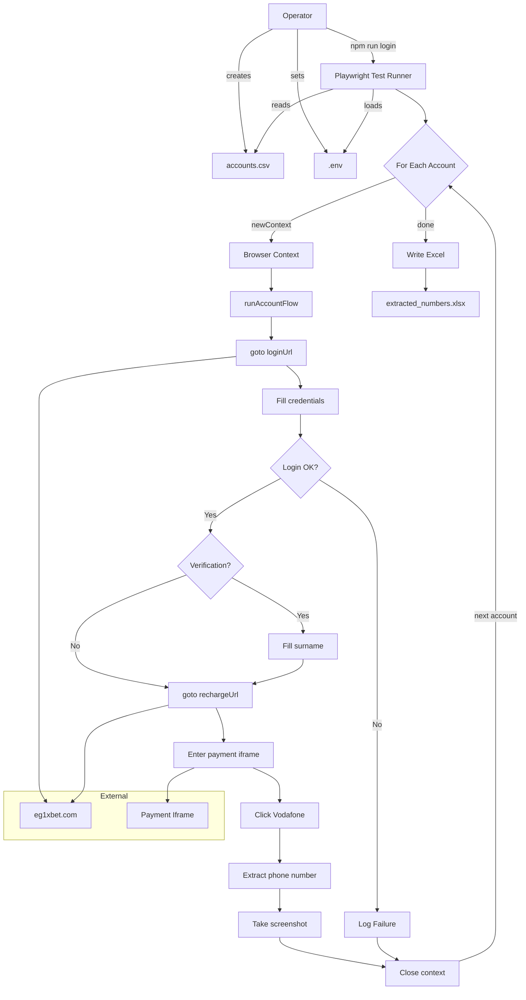
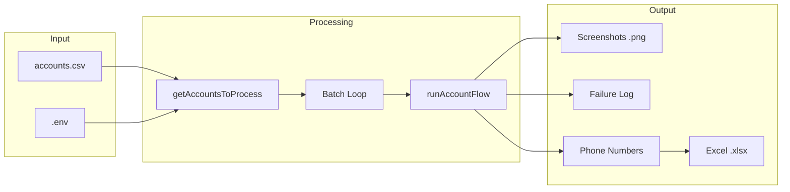
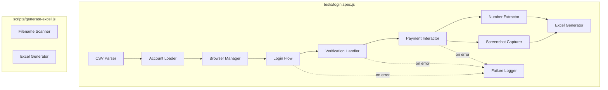

# CODEBASE_KNOWLEDGE.md - Complete Brain Dump

> **Version**: 1.0
> **Last Updated**: 2026-08-02
> **Status**: Authoritative
> **Repository Commit**: `dfa181b` (1xauto HEAD)
>
> **Supersedes**: `master-knowledge-document.md`, `assets/architecture-diagrams.md`
>
> **Repository**: `1xauto` (package name `1xbet-login-flow`)
> **App version**: 0.1.0
> **Purpose**: Playwright browser automation that logs into 1xBet (Egypt), navigates to the Vodafone deposit flow, extracts Egyptian mobile numbers, and captures payment-window screenshots.

---

## Table of Contents

1. [High-Level Overview](#1-high-level-overview)
2. [Architecture and Data Flow](#2-architecture-and-data-flow)
3. [File Index](#3-file-index)
4. [Feature-by-Feature Analysis](#4-feature-by-feature-analysis)
5. [Nuances, Gotchas and Operational Rules](#5-nuances-gotchas-and-operational-rules)
6. [Failure Taxonomy](#6-failure-taxonomy)
7. [Technical Reference and Glossary](#7-technical-reference-and-glossary)
8. [Extension and Modification Guide](#8-extension-and-modification-guide)
9. [Architecture Diagrams (Mermaid)](#9-architecture-diagrams-mermaid)

---

## 1. High-Level Overview

### 1.1 What It Is

A **single-test Playwright automation** that:

1. Reads a batch of 1xBet account credentials from `accounts.csv` or `.env`.
2. For each account, opens a fresh Chromium browser context, logs into `eg1xbet.com`, handles optional surname verification, navigates to the Vodafone deposit page, extracts the displayed Egyptian mobile number (`01XXXXXXXXX`), and takes a screenshot.
3. After the batch completes, writes all unique extracted numbers to `extracted_numbers.xlsx`.

### 1.2 Who Uses It

An **operator** (the repo owner) who needs to:

- Process dozens/hundreds of 1xBet accounts in a single run.
- Collect the Vodafone deposit phone numbers displayed on each account's payment page.
- Screenshot the payment modal for manual verification or record-keeping.
- Manually handle CAPTCHAs, OTPs, or any challenge screens that appear (the browser runs **headed** by default).

### 1.3 Tech Stack

| Layer | Technology | Version (locked) |
|-------|-----------|-----------------|
| Runtime | Node.js | >= 20 |
| Language | JavaScript (ES Modules) | -- |
| Browser automation | Playwright Test | 1.61.1 |
| Env config | dotenv | 16.x |
| Spreadsheet I/O | xlsx (SheetJS) | 0.18.5 |
| CI/CD | GitHub Actions | workflow_dispatch only |

### 1.4 Key Dependencies

- **`@playwright/test`** (devDep): Test runner and Chromium automation.
- **`dotenv`** (devDep): Loads `.env` into `process.env` with `override: true`.
- **`xlsx`** (dep): Creates `.xlsx` Excel files with extracted phone numbers.

### 1.5 Business Purpose

This tool exists to **batch-collect Vodafone payment identifiers** (Egyptian mobile numbers) from 1xBet accounts. The numbers are extracted from the deposit modal's "Copy" buttons and compiled into a spreadsheet. The screenshots serve as visual proof of the payment window state.

---

## 2. Architecture and Data Flow

### 2.1 High-Level Architecture

```
Operator / User
  |-- Creates accounts.csv (or sets .env vars)
  |-- Runs `npm run login` or triggers GitHub Actions
  |-- Manually handles CAPTCHAs/OTPs in the visible browser
  |
  v
Playwright Test Runner (playwright.config.js)
  |-- Loads .env via dotenv (override: true)
  |-- timeout: 0 (unlimited per test)
  |-- headless: only if HEADLESS=true env var
  |-- viewport: 1440x960
  |-- testDir: ./tests
  |
  v
tests/login.spec.js (360 lines)
  |-- Account Loading: getAccountsToProcess()
  |--     |-- CSV Parser: parseCsv() + parseCsvLine()
  |
  |-- For Each Account (sequential loop):
  |     1. browser.newContext() -> new page
  |     2. runAccountFlow(page, account, i, total)
  |        a. goto loginUrl
  |        b. Fill username + password
  |        c. Submit login
  |        d. Detect login failure
  |        e. Handle account verification (surname)
  |        f. goto rechargeUrl
  |        g. Enter payment iframe
  |        h. Click Vodafone option (#vodafone_1)
  |        i. Wait for payment modal
  |        j. Extract phone number from modal
  |        k. Take screenshot
  |     3. Close page + context
  |
  |-- Write Excel: extracted_numbers.xlsx
  |-- Failure logger: logs/failed-accounts.log
  |
  v
External: eg1xbet.com
  |-- /en/user/login           (login page)
  |-- /en/user/accountverify   (surname confirmation)
  |-- /en/office/recharge      (deposit page with payment iframe)
  |-- iframe: /paysystems/deposit/ (Vodafone payment modal)

Optional wrapper: `run-loop.js` (`npm run loop`) re-invokes the whole Playwright run in an infinite loop with a configurable cooldown — used when a batch is larger than one comfortable run.
```

### 2.2 Data Flow

```
accounts.csv  ----+
                  +--> loadAccounts() --> getAccountsToProcess()
.env vars    ----+         |
                           v
                Array of Account {username, password, surname}
                           |
                +----------+----------+
                |  For each account:  |
                |  (sequential loop)  |
                +----------+----------+
                           |
            +--------------+--------------+
            v              v              v
      Screenshot      Phone #        Failure Log
        .png          extracted       (on error)
            |              |
            +--------+-----+
                     v
              extracted_numbers.xlsx
              (after all accounts)
```

### 2.3 External Integrations

| Integration | Type | URL/Target | Purpose |
|------------|------|-----------|---------|
| 1xBet Login | Web | `https://eg1xbet.com/en/user/login` | Authenticate with username/password |
| 1xBet Verification | Web | `/en/user/accountverify` (regex match) | Surname confirmation when challenged |
| 1xBet Recharge | Web | `https://eg1xbet.com/en/office/recharge` | Navigate to deposit page |
| Vodafone Payment | Iframe | `iframe[src*="/paysystems/deposit/"]` | Access Vodafone payment option |
| Vodafone Modal | Iframe child | `#payment_modal_container` | Display payment details with copy buttons |

### 2.4 GitHub Actions Workflow

- **File**: `.github/workflows/playwright.yml` (31 lines)
- **Trigger**: `workflow_dispatch` (manual only)
- **Runner**: `ubuntu-latest`
- **Steps**: Checkout -> Node 20 (`npm install`) -> `npx playwright install chromium` -> `npm run login`
- **Secrets**: `ONEXBET_USERNAME`, `ONEXBET_PASSWORD`, `ONEXBET_SURNAME`
- **Limitation (broken as analyzed)**: no `HEADLESS: 'true'` in the run step, so Playwright launches **headed** on the headless `ubuntu-latest` runner; and `playwright install` omits `--with-deps`, so Chromium's OS libraries are missing. The job cannot launch Chromium today. It also cannot handle manual CAPTCHAs in CI.

---

## 3. File Index

| Priority | Path | Lines | Purpose |
|----------|------|-------|---------|
| **+ (core)** | `tests/login.spec.js` | 360 | **Entire application logic**: CSV parsing, account loading, login flow, verification handling, payment iframe interaction, phone number extraction, screenshot capture, Excel generation |
| **+ (config)** | `playwright.config.js` | 22 | Playwright runner config: test dir, timeout=0, headless toggle, viewport 1440x960, Chromium disk-cache launch args (`.browser-cache`) |
| **+ (config)** | `package.json` | 18 | Project metadata, npm scripts (`login`, `loop`, `excel`), dependencies |
| **+ (runner)** | `run-loop.js` | 26 | Local looping wrapper: re-runs `npm run login` in an infinite loop with a cooldown; forces `HEADLESS=true` |
| **+ (template)** | `.env.example` | 3 | Template for required environment variables |
| **+ (utility)** | `scripts/generate-excel.js` | 30 | Standalone utility: scans `screenshots/` dir for phone-number filenames, generates `extracted_numbers.xlsx` |
| **+ (CI)** | `.github/workflows/playwright.yml` | 31 | GitHub Actions workflow for manual CI runs |
| **+ (docs)** | `README.md` | 74 | Setup instructions, usage, output files |
| **- (log)** | `logs/failed-accounts.log` | 1300+ | Append-only failure log with timestamps and error details |
| **- (meta)** | `deleting clones.txt` | 5 | PowerShell snippets for finding/deleting duplicate directories |
| **- (config)** | `.gitignore` | 8 | Ignores node_modules, .env, accounts.csv, screenshots, test-results, extracted_numbers.xlsx, .browser-cache |

---

## 4. Feature-by-Feature Analysis

### Feature 1: Account Loading and CSV Parsing

**Purpose**: Load credentials from either a CSV file or environment variables, with CSV taking priority. This enables batch processing of hundreds of accounts.

**Technical Details**:

- **Entry**: `getAccountsToProcess()` at `tests/login.spec.js:82`
- **CSV Path**: `path.resolve(process.cwd(), 'accounts.csv')` -- resolved at runtime relative to CWD
- **CSV Parser**: Custom implementation at `tests/login.spec.js:14-63` -- not using a library. Handles quoted fields with escaped double-quotes.
- **Fallback**: If `accounts.csv` does not exist or is empty, falls back to a single account from env vars `ONEXBET_USERNAME`, `ONEXBET_PASSWORD`, `ONEXBET_SURNAME`.
- **Filtering**: Accounts without both `username` AND `password` are filtered out (line 79).
- **Headers**: Case-insensitive (`header.toLowerCase()` at line 53). Expected columns: `username` (optional), `email` (used as the login when `username` is absent — the shipped CSV has no `username` column, only `Email`), `password`, `surname`. Current CSV header: `Region,City,Email,First_name,surname,Password,re-enter_password`.

**Interactions**: Feeds into the main batch loop in the test body (line 325). The `START_INDEX` env var controls which account to resume from.

**Edge Cases**:

- Empty CSV -> falls back to env vars
- Malformed CSV rows -> silently dropped if username/password empty
- `START_INDEX` > account count -> warns and skips all

---

### Feature 2: Browser Login Flow

**Purpose**: Authenticate against the 1xBet Egyptian site (`eg1xbet.com`) for each account.

**Technical Details**:

- **Entry**: `runAccountFlow()` at `tests/login.spec.js:106`
- **Login URL**: `https://eg1xbet.com/en/user/login` (hardcoded, line 6)
- **Locators**:
  - Username: `input#username` (line 125)
  - Password: `input#username-password` (line 126)
  - Submit: `button.auth-form-fields__submit` (line 127)
- **Wait Strategy**:
  - `domcontentloaded` for initial navigation (line 123)
  - 30-second timeout for element visibility (lines 129-131)
  - 10-second timeout for URL change after submit (line 139-142)
- **Failure Detection** (lines 144-159):
  - Checks if URL still contains `/user/login` AND login form is still visible
  - Attempts to extract error hint text matching `/incorrect|invalid|wrong|password|login/i`
  - Throws descriptive error with hint if found, generic message otherwise

**Interactions**: After successful login, proceeds to account verification check, then recharge page navigation.

**Business Logic**: The `.catch(() => {})` on `waitForURL` (line 142) means the script does not fail if the URL does not change -- it just continues and checks the state manually.

---

### Feature 3: Account Verification (Surname Confirmation)

**Purpose**: Handle the optional account verification screen that 1xBet sometimes presents, where the user must confirm their surname.

**Technical Details**:

- **Detection**: After login, waits for navigation to URL matching `/en/user/accountverify(?:[/?#]|$)` with 10s timeout (line 161)
- **Locator**:
  - Surname input: `page.getByRole('textbox')` -- role-based, fragile if page has multiple textboxes
  - Confirm button: `page.getByRole('button', { name: 'Confirm', exact: true })`
- **Validation**: Expects exactly 1 textbox and exactly 1 Confirm button (lines 176-177)
- **Action**: Fills surname, clicks confirm, waits 2 seconds for processing (line 182)
- **Error**: If surname not provided in env/CSV, throws error asking user to set `ONEXBET_SURNAME`

**Interactions**: Only triggered if the site redirects to the verification URL after login. Surname comes from `accounts.csv` or `ONEXBET_SURNAME` env var.

**Gotcha**: The `getByRole('textbox')` selector is very generic. If 1xBet adds any other textbox to the verification page, this will break.

---

### Feature 4: Vodafone Payment Window Interaction

**Purpose**: Navigate to the deposit page, access the payment iframe, select Vodafone, and extract the phone number displayed in the payment modal.

**Technical Details**:

- **Recharge URL**: `https://eg1xbet.com/en/office/recharge` (hardcoded, line 7)
- **Payment iframe locator**: `iframe[src*="/paysystems/deposit/"]` (line 188) -- uses partial `src` match
- **Vodafone option**: `#vodafone_1` inside the payment iframe (line 190)
- **Payment modal**: `#payment_modal_container` inside the iframe (line 191)
- **Amount field**: `#amount` inside the iframe (line 197)

**Phone Number Extraction** (lines 210-261) -- **multi-strategy fallback**:

1. Iterate all `.copy_content_btn.modal-message-btn[title="Copy"]` buttons in the modal
2. For each button, try in order:
   - `data-clipboard-text` attribute with regex `/01\d{9}/`
   - `data-text` attribute with regex `/01\d{9}/`
   - Button's own `textContent()` with regex `/01\d{9}/`
   - Parent element's `textContent()` with regex `/01\d{9}/`
3. If no number found from copy buttons, scan the entire `paymentModal.textContent()` as a final fallback

**Interactions**: The extracted number is added to the global `uniqueNumbers` Set and `screenshotCounts` Map, which are later used for screenshot naming and Excel generation.

---

### Feature 5: Screenshot Capture and Naming

**Purpose**: Capture a screenshot of the payment window and name it with the extracted phone number for easy identification.

**Technical Details**:

- **Naming logic** (lines 263-283):
  - If number extracted: `<number>.png` (first occurrence), `<number>(N).png` for duplicates
  - If no number: `vodafone-deposit-<ISO-timestamp>.png`
- **Duplicate handling**: `screenshotCounts` Map tracks per-number count. While the target filename exists, increment counter (line 274-278).
- **Screenshot area**: Clipped to viewport width and the bottom of the payment modal: `{x:0, y:0, width: viewport.width, height: ceil(modalBox.y + modalBox.height)}` (lines 288-296)
- **Directory**: `screenshots/` created with `mkdirSync(recursive: true)` (line 286)

**Interactions**: Screenshots feed into `scripts/generate-excel.js` which scans filenames for phone numbers. Also, the Excel file generated at the end of the test uses the `uniqueNumbers` Set.

---

### Feature 6: Excel Generation (Phone Numbers)

**Purpose**: Compile all unique extracted Egyptian mobile numbers into an Excel spreadsheet.

**Two paths**:

**Path A: In-test generation (automatic)**

- **Location**: `tests/login.spec.js:349-359` -- runs after the entire batch completes
- **Input**: `uniqueNumbers` Set (global, accumulated across all accounts)
- **Output**: `extracted_numbers.xlsx` in project root
- **Library**: `xlsx` (SheetJS)

**Path B: Standalone script (`scripts/generate-excel.js`)**

- **Trigger**: `npm run excel`
- **Input**: Scans `screenshots/` directory for `.png` files, extracts phone numbers from filenames via regex `/(01\d{9})/`
- **Output**: Same `extracted_numbers.xlsx`
- **Purpose**: Regenerate the Excel without re-running the browser automation

---

### Feature 7: Batch Processing with Resume Support

**Purpose**: Process a large number of accounts sequentially, with the ability to resume from a specific index.

**Technical Details**:

- **Loop**: Sequential `for...of` over accounts (line 325) -- accounts are processed one at a time, not in parallel
- **Browser isolation**: Each account gets a fresh `browser.newContext()` + `page` (lines 329-330) -- no session leakage
- **START_INDEX**: Env var (1-based) to skip accounts before that index (lines 312-323)
- **Cleanup**: Each iteration closes page and context in `finally` block (lines 340-346), with a 2-second delay between accounts (line 341)
- **Error isolation**: Failures are caught per-account, logged, and the loop continues (lines 334-338)

**Interactions**: The `screenshotCounts` and `uniqueNumbers` global Maps persist across the entire batch run (cleared at test start, line 302-303).

---

### Feature 8: Failure Logging

**Purpose**: Record all account-level failures with timestamps for later review.

**Technical Details**:

- **Location**: `logFailure()` at `tests/login.spec.js:98-104`
- **Path**: `logs/failed-accounts.log`
- **Format**: `[ISO-timestamp] username | error.message`
- **Append-only**: Uses `appendFileSync` -- multiple runs accumulate
- **Directory creation**: `mkdirSync(recursive: true)` ensures `logs/` exists

**Failure categories observed in the log**:

| Error Pattern | Count | Root Cause |
|--------------|-------|------------|
| `locator('input#username').toBeVisible()` timeout | ~60+ | Login page not loading / site blocking / CAPTCHA |
| `locator('#vodafone_1').toBeVisible()` timeout | ~30+ | Vodafone option not available for account / payment iframe not loading |
| `Login failed: Select a login option` | ~15 | Login form shows alternative login methods instead of username/password |
| `ENOSPC: no space left on device, write` | ~12 | Disk full -- screenshots filling up |
| `page.goto: Target page, context or browser has been closed` | ~5 | Browser/page closed unexpectedly (user intervention or crash) |
| `net::ERR_CONNECTION_CLOSED` | 2 | Network/server issue |
| `locator.click: Target page, context or browser has been closed` | 3 | Click attempted after page closure |
| `getByRole('textbox').toHaveCount(1)` fails (received 0) | 2 | Verification page UI changed |
| `#payment_modal_container` hidden | 1 | Modal exists but not visible |
| `copy_content_btn` not found | 2 | Copy button not rendered in modal |

---

### Feature 9: Looping Wrapper (`run-loop.js`)

**Purpose**: Re-run the entire `npm run login` batch automatically until stopped, so a large CSV can be processed over multiple Playwright invocations without operator attention.

**Technical Details**:

- **Entry**: top-level script `run-loop.js` (26 lines), invoked via `npm run loop`.
- **Config**: `COOLDOWN_MINUTES` (default `10`) pause between runs; `START_INDEX` passed through to the spec for resume; `HEADLESS` forced to `'true'` (line 6).
- **Loop**: infinite `while (true)` -> `execSync('npm run login', { stdio: 'inherit', env: process.env })` -> `await setTimeout(COOLDOWN_MS)`.
- **Error tolerance**: the `catch` on the sync call logs `Finished with errors` and still proceeds to the cooldown — the loop never stops on failure.

**Interactions**: Because it re-spawns the Playwright process, in-process state (`uniqueNumbers`, `screenshotCounts`) is lost between runs — resume relies on `START_INDEX`. The top-level `await` only works because the package is ESM (`"type": "module"`).

---

## 5. Nuances, Gotchas and Operational Rules

### 5.1 Critical Gotchas

1. **The `.catch(() => {})` on line 142 swallows the timeout error from `waitForURL`**. If login fails silently (no URL change), the script still detects it by re-checking the URL and login form visibility (lines 144-159). But if the page partially loads and the form disappears, it could slip through.

2. **`parseCsvLine()` is a hand-rolled CSV parser** (lines 14-41). It handles double-quote escaping but NOT:
   - Newlines inside quoted fields
   - Different line endings (partially handled via `split(/\r?\n/)`)
   - Leading BOM characters

3. **`password === surname` guard** (line 115-118): If an account has the same password and surname, the script throws. This is a deliberate anti-misconfiguration check -- the surname field is used for account verification, and having it match the password would be a mistake.

4. **The regex `/01\d{9}/` is hardcoded for Egyptian mobile numbers** (11 digits starting with `01`). This is region-specific and will not work for other countries' phone numbers.

5. **`screenshotCounts` and `uniqueNumbers` are module-level globals** (lines 11-12). They are cleared at test start (lines 302-303) but persist across accounts within a run. This is intentional -- they track cross-account deduplication.

6. **The payment iframe locator `iframe[src*="/paysystems/deposit/"]`** uses a partial match on the `src` attribute. If 1xBet changes this URL path, the entire payment flow breaks.

7. **The `START_INDEX` is 1-based** (line 314), matching human counting. Internally, the loop skips indices `< startIndex - 1` (line 326-328).

8. **The test timeout is 0 (unlimited)** (`playwright.config.js:9` and `test.setTimeout(0)` at line 301). Long batches can run for hours.

9. **`.catch(() => {})` pattern** is used extensively (lines 142, 145, 344, 345) to make operations best-effort. This is intentional for resilience but makes debugging harder.

10. **The Excel output path is relative to CWD**, not the script directory (line 354). Same for `accounts.csv` (line 9) and `screenshots/` (line 286).

### 5.2 Security Considerations

- Credentials are in `.env` (gitignored) or `accounts.csv` (gitignored). Neither should be committed.
- The GitHub Actions workflow uses repository secrets for the env vars.
- No credential encryption at rest -- relies on filesystem permissions.
- The automation does NOT bypass CAPTCHAs, OTPs, or security controls -- it is designed for manual operator intervention.

### 5.3 Performance Characteristics

- **Sequential processing**: One account at a time. No parallelism.
- **2-second delay between accounts** (line 341) -- likely to avoid rate limiting.
- **30-second timeout** on most locator waits -- conservative to account for slow loads.
- **No retry logic** -- if an account fails, it moves to the next.
- **Disk usage**: Each run generates screenshots (PNG files). The `ENOSPC` errors in the log show this can fill disk on long runs.

### 5.4 Platform Notes

- **Primary target**: Windows (PowerShell). The `deleting clones.txt` has PowerShell snippets.
- **Cross-platform**: Uses `path.resolve()` and `path.join()` for paths. Should work on macOS/Linux.
- **GitHub Actions**: Runs on `ubuntu-latest`.

---

## 6. Failure Taxonomy

### Common Failure Modes and Remedies

| Failure | Cause | Remedy |
|---------|-------|--------|
| `input#username` not found | Login page blocked/changed, CAPTCHA challenge, rate limiting | Check manually, increase delay between accounts |
| `#vodafone_1` not found | Vodafone payment not available for account/region, iframe not loaded | Verify account has Vodafone option, check iframe load |
| `Login failed: Select a login option` | Site shows alternative login methods (email, phone, social) | Update selectors to handle alternative login UI |
| `ENOSPC: no space left on device` | Disk full from screenshots | Clean `screenshots/` directory before batch run |
| `Target page, context or browser has been closed` | User closed browser, browser crash | Run in headed mode, check for OS-level issues |
| `net::ERR_CONNECTION_CLOSED` | Network issue, IP blocking | Check connectivity, add retry with backoff |
| `getByRole('textbox').toHaveCount(1)` fails | Verification page UI changed | Update selectors for new verification layout |
| `copy_content_btn` not found | Payment modal rendered without copy buttons | Check modal content structure, update selectors |

---

## 7. Technical Reference and Glossary

### 7.1 Glossary

| Term | Definition |
|------|-----------|
| **1xBet** | International online betting platform. This tool targets the Egyptian instance (`eg1xbet.com`). |
| **Vodafone deposit** | A payment method on 1xBet Egypt using Vodafone mobile wallet. The deposit modal shows a phone number to send money to. |
| **Account verification** | A security step where 1xBet asks for surname confirmation after login. |
| **Recharge** | 1xBet's term for the deposit/top-up page. |
| **Payment iframe** | An embedded iframe on the recharge page that hosts payment system UIs (Vodafone, etc.). |
| **Egyptian mobile number** | An 11-digit number starting with `01` (regex: `01\d{9}`). |
| **Copy button** | UI element in the payment modal that contains the phone number for copying. |
| **START_INDEX** | Environment variable to resume batch processing from a specific 1-based record number. |
| **Browser context** | Playwright's isolated browser session -- each account gets a fresh one to prevent session leakage. |

### 7.2 Key Functions and Their Locations

| Function | File | Lines | Purpose |
|----------|------|-------|---------|
| `parseCsvLine(line)` | `tests/login.spec.js` | 14-41 | Parse a single CSV line with quote handling |
| `parseCsv(text)` | `tests/login.spec.js` | 43-63 | Parse full CSV text into array of objects |
| `loadAccounts()` | `tests/login.spec.js` | 65-80 | Load accounts from `accounts.csv` file |
| `getAccountsToProcess()` | `tests/login.spec.js` | 82-96 | Get accounts from CSV or fall back to env vars |
| `logFailure(account, error)` | `tests/login.spec.js` | 98-104 | Append failure entry to log file |
| `runAccountFlow(page, account, index, total)` | `tests/login.spec.js` | 106-298 | **Main flow**: login, verify, recharge, extract, screenshot |
| `test('sign in to 1xBet', ...)` | `tests/login.spec.js` | 300-359 | **Test entry point**: loads accounts, runs batch loop, generates Excel |
| main logic | `scripts/generate-excel.js` | 1-30 | Standalone Excel generator from screenshot filenames |
| top-level loop | `run-loop.js` | 13-25 | Infinite re-run of `npm run login` with cooldown (see Feature 9) |

### 7.3 Key Constants and URLs

| Constant | Value | Location |
|----------|-------|----------|
| `loginUrl` | `https://eg1xbet.com/en/user/login` | `tests/login.spec.js:6` |
| `rechargeUrl` | `https://eg1xbet.com/en/office/recharge` | `tests/login.spec.js:7` |
| `accountVerificationUrl` | `/\/en\/user\/accountverify(?:[/?#]\|$)/` | `tests/login.spec.js:8` |
| `accountsFilePath` | `path.resolve(process.cwd(), 'accounts.csv')` | `tests/login.spec.js:9` |
| `failuresLogPath` | `path.resolve(process.cwd(), 'logs', 'failed-accounts.log')` | `tests/login.spec.js:10` |

### 7.4 CSS/DOM Selectors Used

| Selector | Context | Target |
|----------|---------|--------|
| `input#username` | Login page | Username input field |
| `input#username-password` | Login page | Password input field |
| `button.auth-form-fields__submit` | Login page | Submit/login button |
| `iframe[src*="/paysystems/deposit/"]` | Recharge page | Payment systems iframe |
| `#vodafone_1` | Payment iframe | Vodafone payment option |
| `#payment_modal_container` | Payment iframe | Payment modal container |
| `#amount` | Payment iframe | Amount input/display |
| `#payment_modal_container span.copy_content_btn.modal-message-btn[title="Copy"]` | Payment iframe | Copy buttons in modal |
| `text=/incorrect\|invalid\|wrong\|password\|login/i` | Login page | Error hint text |

### 7.5 npm Scripts

| Script | Command | Purpose |
|--------|---------|---------|
| `login` | `playwright test` | Run the main automation flow |
| `loop` | `node run-loop.js` | Re-run `login` in an infinite loop with a cooldown (see Feature 9) |
| `excel` | `node scripts/generate-excel.js` | Regenerate Excel from screenshot filenames |

### 7.6 Playwright Config (`playwright.config.js`)

```javascript
{
  testDir: './tests',
  timeout: 0,                    // Unlimited test timeout
  use: {
    headless: process.env.HEADLESS === 'true',  // Headed by default; CI must set HEADLESS=true
    screenshot: 'off',           // no auto screenshots; the spec takes its own explicit ones
    trace: 'off',
    viewport: { width: 1440, height: 960 },
    launchOptions: {
      args: [
        `--disk-cache-dir=${process.cwd()}\\.browser-cache`,  // 1 GB Chromium disk cache
        '--disk-cache-size=1073741824'
      ]
    }
  }
}
```

- `dotenv.config({ override: true })` -- local `.env` takes precedence over system env vars.

---

## 8. Extension and Modification Guide

### 8.1 Adding a New Payment Method

1. Navigate to the recharge page (same URL).
2. In the payment iframe, identify the new payment option's selector (replacing `#vodafone_1`).
3. Adjust the phone number extraction logic if the new method uses different DOM structure.
4. Update the screenshot naming if needed.

### 8.2 Adding Parallel Account Processing

The current architecture processes accounts **sequentially**. To add parallelism:

- Use Playwright's `test.describe.parallel()` or process accounts in worker threads.
- **Caution**: The `screenshotCounts` and `uniqueNumbers` globals would need synchronization.
- **Caution**: Rate limiting -- 1xBet may block concurrent logins from the same IP.

### 8.3 Adding Retry Logic

Currently, each account gets one attempt. To add retries:

- Wrap `runAccountFlow()` in a retry loop inside the `for...of` block.
- Log each retry attempt.
- Consider exponential backoff between retries.

### 8.4 Modifying the CSV Format

The CSV parser in `parseCsvLine()` (line 14-41) handles standard CSV with double-quote escaping. To support new columns:

- Add the column name to the CSV header row.
- Access it via `row.newcolumn` in the `loadAccounts()` map (line 73-78).
- Pass it through to `runAccountFlow()` if needed.

### 8.5 Cross-Cutting Concerns

| Concern | Current Implementation | Improvement Opportunity |
|---------|----------------------|----------------------|
| **Error handling** | Per-account try/catch with `.catch(() => {})` | Structured error types, retry policy |
| **Logging** | Console + append-only file log | Structured logging, log levels |
| **Configuration** | `.env` + hardcoded constants | Centralized config module |
| **Selector management** | Inline CSS selectors | Page Object Model pattern |
| **Rate limiting** | 2-second fixed delay | Adaptive delay, exponential backoff |
| **Monitoring** | None | Progress bar, completion stats |
| **Testing** | None (no unit tests) | Unit tests for CSV parser, number extraction |

### 8.6 Things You Must Know Before Changing Code

1. **The CSV parser is custom** -- do not assume it behaves like a library. Test edge cases.
2. **The regex `/01\d{9}/` is Egyptian-specific** -- changing the target country requires updating this in multiple places (lines 223, 231, 239, 247, 257, and `scripts/generate-excel.js:11`).
3. **Global state** (`screenshotCounts`, `uniqueNumbers`) is cleared once at test start. If you add multiple test cases, they will share this state.
4. **The `page.screenshot()` clip** uses the viewport width and modal height -- if you change the viewport size, screenshots will change.
5. **The payment iframe is cross-origin** -- Playwright's `frameLocator` handles this, but be aware that JavaScript evaluation inside the iframe may be restricted.
6. **No Page Object Model** -- all selectors are inline in `runAccountFlow()`. Any UI change requires editing this 190-line function.
7. **The `START_INDEX` is off-by-one sensitive** -- it is 1-based for users but the loop uses 0-based indexing internally.
8. **The `scripts/generate-excel.js` and the in-test Excel generation are independent** -- they produce the same output but from different inputs (filenames vs. runtime Set).
9. **The `logs/failed-accounts.log` accumulates across runs** -- never automatically cleaned. Consider rotation.
10. **The GitHub Actions workflow runs headless** -- it cannot handle manual CAPTCHA/OTP. It only works for accounts that do not trigger security challenges.

---

## 9. Architecture Diagrams (Mermaid)

*(Merged from the former `assets/architecture-diagrams.md`.)*

### 9.1 High-Level Flow



### 9.2 Data Flow



### 9.3 Component Interaction


